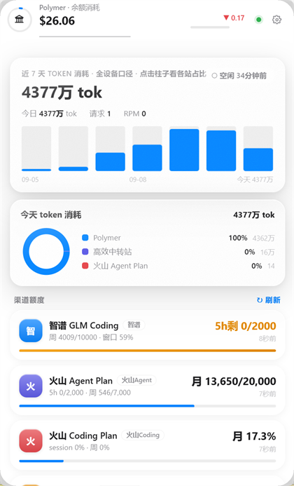

# QuotaHUD · LLM 额度 / 消耗悬浮窗

一个 Windows 常驻桌面的小工具：把你订阅的**各家模型服务**（中转站 + 官方）的**余额、额度窗口、
token 消耗**聚合到一个**液态玻璃悬浮窗**里，不用再一个个打开网站控制台去看。

- 🪟 **迷你胶囊态**：只显示最近一次余额变动的站点，单击下拉完整面板
- 🍎 **液态玻璃视觉**：Windows DWM Acrylic + 白玻璃/顶部高光/轻噪点，无边框、可拖动、不在任务栏占位
- 📊 **全设备口径 token 统计**：直连站点账本接口，另一台电脑/手机上的消耗同样计入
- 🔌 **设置页随时新增站点**，不用改代码；凭证只落本机
- 🪫 **零 token 消耗**：只调账户管理接口，不产生任何模型调用费用

> 界面文字为中文；代码/接口层与语言无关。

## 界面预览

| 迷你胶囊态（默认，只显示最近余额变动的站） | 展开面板（单击胶囊下拉） |
|:---:|:---:|
|  |  |

> 截图为实际运行效果，站点与金额为**演示数据**（截图脚本见 `.tools/`，不进仓库）。

---

## 功能

| 模块 | 说明 |
|---|---|
| 余额卡片 | 每站一张卡：主数字（余额/额度）、副行（已用/次数/服务器 24h token）、用量进度条、最近更新时间 |
| 迷你胶囊 | 环形仪表显示该站用量占比 + 数字滚动动画；**单击**展开/收起（拖动只移动，不触发下拉） |
| 近 7 天柱图 | 全设备口径 token 柱状图（服务器数据优先，本机日志兜底）；**点击柱子**看当日各站占比环形图 |
| 实时用量 | 本机 RPM、今日 tokens/请求数、空闲时长（读 cc-switch 本地日志，只读打开） |
| 变更高亮 | 余额一变动，胶囊自动切到该站并播放高亮/粒子动效 |
| 设置页 | 站点增删改、凭证填写、单站「测试」连通性 |
| 托盘 | 最小化到托盘（不占任务栏），托盘菜单显示/隐藏/退出 |

## 安装（用户）

从 [Releases](https://github.com/AXXXt/quota-hud/releases/latest) 下载，两种方式任选：

| 方式 | 文件 | 特点 |
|---|---|---|
| **安装版（推荐）** | `QuotaHUD-Setup-*.exe` | 装到 `%LOCALAPPDATA%\QuotaHUD`（免管理员）、可勾选开机自启、有开始菜单与桌面图标、带卸载 |
| **便携版** | `QuotaHUD-Portable-*.exe` | **单个 exe**，放任意目录双击即用、不写注册表；首次启动慢 1~3 秒（解压运行时到临时目录） |

> ⚠️ **不要**单独复制 `dist\QuotaHUD\QuotaHUD.exe` —— 那是 PyInstaller「文件夹版」的主程序，
> 必须与同目录的 `_internal` 文件夹**放在一起**才能运行；单独拿出去双击会报「文件或资源错误」。
> 想要单文件就用上面的**便携版**。

- 首次启动只默认开启 DeepSeek 示例站，其余站点请在悬浮窗「设置」里自行添加
- 两者都**未做代码签名**，Windows 可能弹 SmartScreen 警告 → 点「更多信息」→「仍要运行」

## 从源码运行

```bash
uv venv .venv && uv pip install -p .venv/Scripts/python.exe -r requirements.txt
.venv/Scripts/python.exe main.py
```

无头模式（只跑服务与轮询，不开窗）：`main.py --no-window`
本地接口：`http://127.0.0.1:15729/api/state`（**仅监听 127.0.0.1**）

## 新增站点

设置页 →「＋新增站点」→ 选适配器类型。各类型要填什么、怎么拿：

| 适配器 | 适用站点 | 需要填 | 获取方式 |
|---|---|---|---|
| `newapi` | 大多数中转站（new-api / one-api 系） | 站点地址 + Cookie + 用户 ID | 登录站点 → F12 → Network → 任意请求的 `Cookie` 整串；控制台执行 `JSON.parse(localStorage.user).id` |
| `newapi_refresh` | 带 refresh 的 new-api 改版站点 | Cookie 整串 | 同上。⚠ 这类站点刷新会**轮换 cookie**，应用会自动保管新值，浏览器端可能需重新登录一次 |
| `gateway` | 自建 AI API 网关（`/api/v1/auth/me` 风格） | 站点地址 + auth_token | 控制台执行 `localStorage.auth_token` |
| `bigmodel` | 智谱 GLM Coding Plan | `bigmodel_token_production` 的值 | F12 → Application → Cookies |
| `volc_agent` / `volc_coding` | 火山方舟 Agent Plan / Coding Plan | 浏览器 Cookie | F12 → Network → 任意请求的 Cookie 整串 |
| `deepseek` | DeepSeek 官方 | API Key | platform.deepseek.com |
| `bearer_generic` | 任何返回 JSON 的余额接口 | Key + 查询 URL + 取值路径（点路径，如 `data.balance`） | 自定义 |

**本机日志兜底**：如果某站没有可查的账本接口，卡片仍会显示，但 token 只统计本机。
本机数据来自 [cc-switch](https://github.com/farion1231/cc-switch) 的本地库
`~/.cc-switch/cc-switch.db`（**只读**打开，可用环境变量 `CC_SWITCH_DB` 指定其它路径）。

## 数据口径（重要）

- **余额**：与站点控制台**同源**（直接调它自己的账户接口），不是本地估算
- **token**：优先取**站点服务器账本**（因此**多台电脑/手机的消耗都在内**）；站点没有账本接口时，退回本机
  cc-switch 日志统计并标注
- **货币**：按各站原币种显示（`$` / `¥`），不做汇率换算；不显示跨站合计金额（各站计费单位不同）

## 数据与隐私

- 凭证存 `%APPDATA%\QuotaHUD\credentials.json`（写入时 chmod 0600），**只在本机**，不上传任何服务器
- 站点配置 `%APPDATA%\QuotaHUD\stations.json`，状态缓存 `state.json`
- 卸载**不会**删除该目录（保留你的凭证与配置）
- 服务只监听回环地址，局域网内不可访问
- 本仓库不含任何凭证；`credentials.json` / `stations.json` / `state.json` 已在 `.gitignore` 中

## 常见问题

| 现象 | 原因 / 解决 |
|---|---|
| 双击 exe 弹出「**文件或资源错误**」 | 你把「文件夹版」的 `QuotaHUD.exe` 单独复制出来了。它必须和 `_internal` 文件夹同目录；想要单文件请下**便携版** |
| 双击后没反应、悬浮窗不出现 | 多半是**已在运行**：看系统托盘（可能收在「^」里）双击图标显示。若是启动失败，会弹窗说明原因，详情见 `%APPDATA%\QuotaHUD\startup.log` |
| 提示「未知发布者」/ SmartScreen | 未做代码签名，点「更多信息」→「仍要运行」 |
| 某站卡片显示错误 | 凭证过期（cookie 类站点常见）。在设置页重新粘贴 Cookie；`newapi_refresh` 类型站点刷新时会轮换 cookie，属正常现象 |
| 卡片 token 只统计本机 | 该站没有可查的服务端账本接口，自动回退本机日志统计（卡片副行会注明） |
| 想换端口 | `QuotaHUD.exe --port 15800` |

## 架构

```
main.py         入口：pywebview 窗口 + DWM 液态玻璃 + 托盘 + 无头模式
quota_hud.py    核心：站点适配器、凭证存储、服务器口径按天采集、本机用量 SQL
server_api.py   本地 FastAPI（127.0.0.1:15729）
web/index.html  界面（胶囊态 / 下拉面板 / 设置页，单文件无构建）
QuotaHUD.spec   PyInstaller 打包（onedir）
QuotaHUD.iss    Inno Setup 安装包脚本
```

轮询节奏：余额/站点状态 **3 分钟**；服务器按天 token **10 分钟**（后台线程，多线程并行拉取）。
数据未变化时前端零重绘（签名比对），避免闪烁。

## 打包

```bash
build.bat        # 一键：图标 → 文件夹版(PyInstaller) → 便携版(onefile) → 安装包(Inno Setup)
# 产物：
#   dist/QuotaHUD/QuotaHUD.exe                文件夹版（需与 _internal 同目录，供安装包使用）
#   dist/QuotaHUD-Portable.exe                便携版单文件（可直接分发）
#   Output/QuotaHUD-Setup-1.0.1.exe           安装包
#   Output/QuotaHUD-Portable-1.0.1.exe        便携版（复制到 Output）
```

需要 Python 3.11+、[Inno Setup 6](https://jrsoftware.org/isinfo.php)（仅做安装包需要）。

## 添加新站点类型（开发者）

在 `quota_hud.py` 里写一个 `q_xxx(st, cred) -> dict`，返回统一结构：

```python
_r(ok=True, main="$12.34", sub="已用 $5.00", used=5.0, limit=12.34, unit="USD", pct=40)
```

然后注册到 `ADAPTERS = {"xxx": q_xxx, ...}` 即可，前端自动渲染。

## License

MIT © 2026 AXXXt —— 详见 [LICENSE](LICENSE)。
